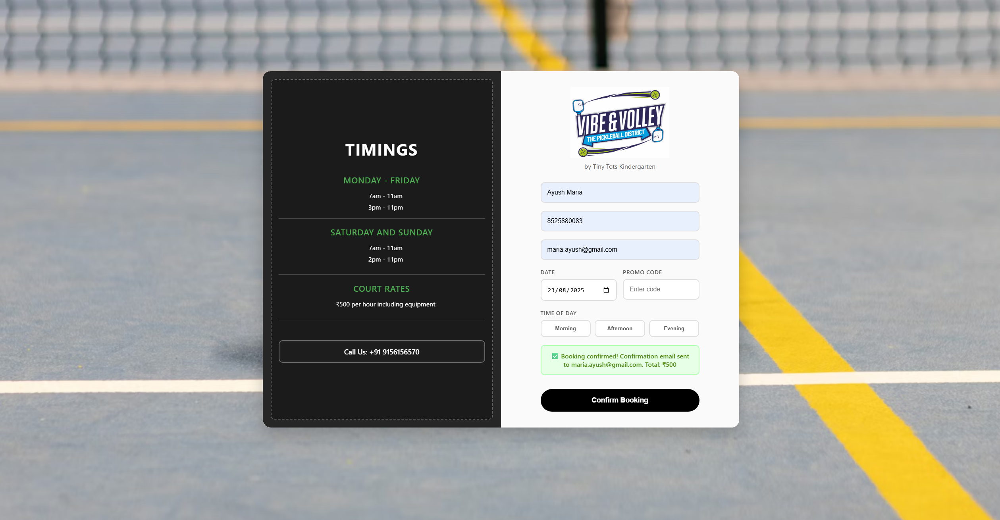

# Vibe & Volley — The Pickleball District

The official **court booking web app** for Vibe & Volley, a pickleball venue in Pune. Built with React and backed by Supabase, it lets customers book 30-minute court slots in real time, manage their bookings, and receive confirmation emails automatically.

**Live:** [vibe-volley-fresh.vercel.app](https://vibe-volley-fresh.vercel.app)



---

## Features

### Customer Booking (`/`)
- Select a date, time block (Morning / Afternoon / Evening), and one or more 30-minute slots
- Real-time slot availability — booked slots are fetched live via Supabase Realtime (Postgres CDC)
- Race-condition protection — slot availability is re-verified right before submission
- Promo code support — `VIBESLOT` reduces pricing to ₹75/player for eligible 4:00 PM – 6:00 PM slots
- Automatic confirmation email sent via EmailJS on successful booking
- Banned phone/email list to block repeat bad-faith bookings
- 11 PM cutoff rule — blocks next-morning bookings after 11:00 PM
- Maintenance mode toggle — flip `IS_UNDER_MAINTENANCE` to instantly show a maintenance page

### Manage Bookings (`/manage`)
- Customers look up their upcoming bookings by phone number
- Self-service cancellation of any upcoming booking

### Admin Dashboard (`/admin`) — Protected
- View all bookings with full details (name, phone, email, date, slots, price, promo code)
- Filter by date or search by phone number
- Delete any booking
- Live revenue summary (total bookings · total revenue ₹)
- Protected by a `localStorage`-based login session

### Staff View (`/staff`)
- Simplified read-only bookings dashboard for on-site staff
- Shows date, slots, name, phone, and total price
- No delete capability or sensitive columns exposed

---

## Routes

| Route | Component | Access |
|---|---|---|
| `/` | `BookingForm` | Public (or Maintenance page) |
| `/manage` | `ManageBookings` | Public (or Maintenance page) |
| `/login` | `Login` | Public |
| `/admin` | `AdminBookings` | Protected (login required) |
| `/staff` | `StaffBookings` | Public (internal use) |

---

## Court Timings & Pricing

| Day | Morning | Evening |
|---|---|---|
| Monday – Friday | 7:00 AM – 11:00 AM | 4:00 PM – 11:00 PM |
| Saturday & Sunday | 7:00 AM – 11:00 AM | 4:00 PM – 11:00 PM |

**Rate:** ₹500 per hour (including equipment) · ₹250 per 30-min slot

**VIBESLOT promo:** ₹75 per player, valid for 4:00 PM – 6:00 PM slots only.

---

## Tech Stack

| Layer | Technology |
|---|---|
| Frontend | React 19, React Router DOM v7 |
| Database | Supabase (PostgreSQL) |
| Realtime | Supabase Realtime (Postgres CDC) |
| Email | EmailJS (`@emailjs/browser`) |
| Deployment | Vercel |
| Styling | Custom CSS (`App.css`) |

---

## Project Structure

```
vibe-volley-fresh/
├── public/
│   ├── logo.jpg              # Venue logo (left panel)
│   └── FE_logo.png           # "Powered by" logo
├── src/
│   ├── App.js                # All components & routing (1200+ lines)
│   ├── App.css               # All styles
│   ├── supabaseClient.js     # Supabase client initialisation
│   └── index.js              # React entry point
├── package.json
└── .gitignore
```

---

## Setup

**1. Clone the repo**
```bash
git clone https://github.com/AyushMaria/vibe-volley-fresh.git
cd vibe-volley-fresh
```

**2. Install dependencies**
```bash
npm install
```

**3. Create a `.env` file** in the project root:
```env
REACT_APP_SUPABASE_URL=https://your-project.supabase.co
REACT_APP_SUPABASE_ANON_KEY=your-supabase-anon-key
REACT_APP_EMAILJS_SERVICE_ID=your-emailjs-service-id
REACT_APP_EMAILJS_TEMPLATE_ID=your-emailjs-template-id
REACT_APP_EMAILJS_PUBLIC_KEY=your-emailjs-public-key
```

**4. Set up the Supabase table**

```sql
create table bookings (
  id uuid default gen_random_uuid() primary key,
  name text not null,
  phone text not null,
  email text not null,
  booking_date date not null,
  time_block text not null,
  slots jsonb not null,
  promo_code text,
  total_price numeric default 0,
  created_at timestamp with time zone default now()
);
```

Enable **Realtime** on the `bookings` table in your Supabase dashboard.

**5. Run the app**
```bash
npm start
```

Open [http://localhost:3000](http://localhost:3000).

---

## Deployment

This app is deployed on **Vercel**. To deploy your own instance:

1. Push to GitHub
2. Import the repo on [vercel.com](https://vercel.com)
3. Add all `REACT_APP_*` environment variables in Vercel project settings
4. Deploy

---

## Key Implementation Details

### Realtime Slot Sync
The booking form subscribes to Supabase Realtime on mount. Any booking made by another user is reflected immediately — the booked slot turns red and becomes unselectable without a page refresh.

### Race Condition Guard
Before inserting a booking, the app re-fetches the latest booked slots. If any of the user’s selected slots were taken in the window between viewing and submitting, the booking is rejected and the UI is updated.

### Maintenance Mode
Flip `IS_UNDER_MAINTENANCE = true` in `App.js` to replace `/` and `/manage` with a maintenance page pointing to the Instagram handle `@vibeandvolley`.

### Ban List
Phone numbers and emails can be added to `BANNED_PHONES` and `BANNED_EMAILS` arrays in `App.js` to silently block submissions from specific users.

---

## Available Scripts

| Command | Description |
|---|---|
| `npm start` | Run in development mode at `http://localhost:3000` |
| `npm run build` | Build optimised production bundle |
| `npm test` | Run tests in interactive watch mode |
| `npm run eject` | Eject from Create React App (irreversible) |

---

## License

MIT
